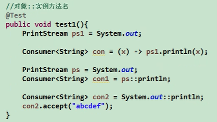
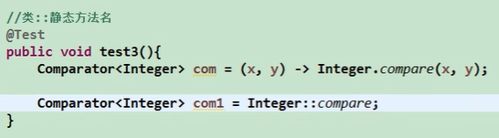

#java8新特性学习

###1.为什么需要使用lambda表达式

Note:
1、方法引用的时候，所引用的方法的形参和返回值，需要与功能接口
实现的抽象方法的形参和返回值保持一致。

2、如果lambda表达式中第一个参数是【实例方法的调用者】，第二个
参数是【实例方法的参数】时，可以使用【类名::成员方法名】

3、【构造器引用】的使用中，需要调用的【构造器参数列表】要与
【函数式接口中抽象方法的参数列表】保持一致

####练习题：

