###1、streamAPI
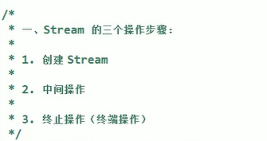

####创建流

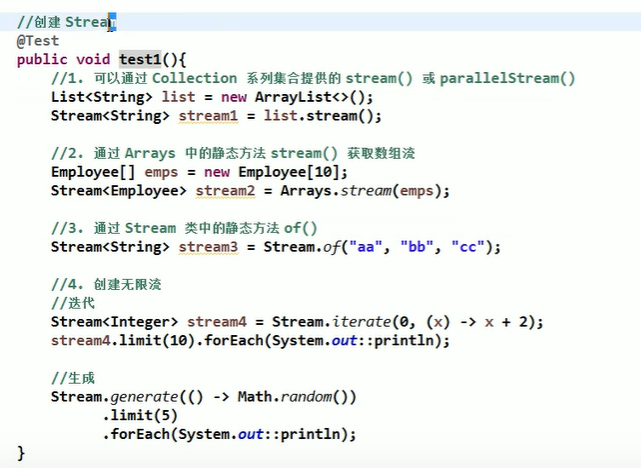

####中间操作

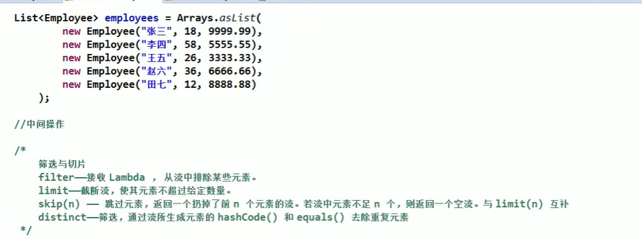

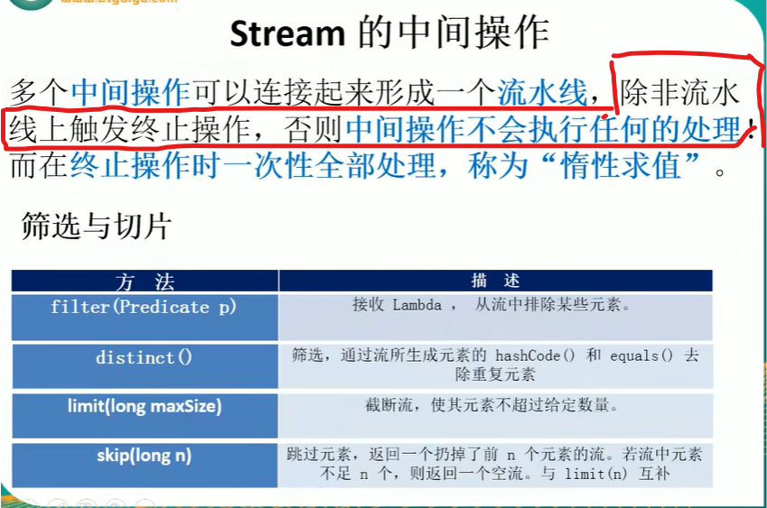

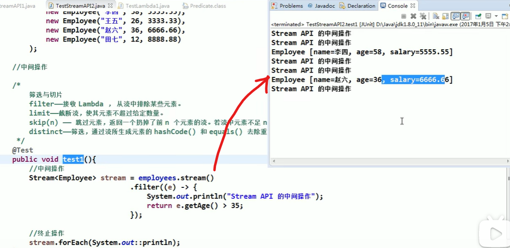

1）中间操作，map：
map接受一个lambda表达式函数作为该方法的参数，将元素转换成
其他形式或者提取信息。  
集合中的每个元素都作为map的lambda表达式函数的参数，被这个函数
作用，映射成新的元素。

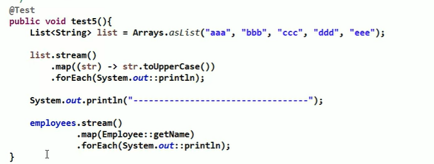

2）中间操作，flatmap：
接受一个返回值为stream对象的lambda表达式函数作为参数，
将流中的每一个值都换成新的流， 然后将所有流合并连接成一个流

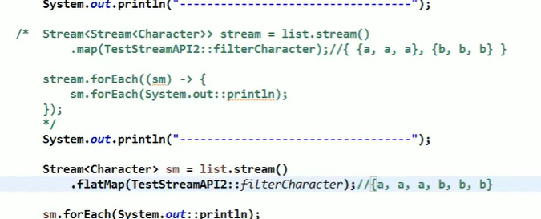

排序操作
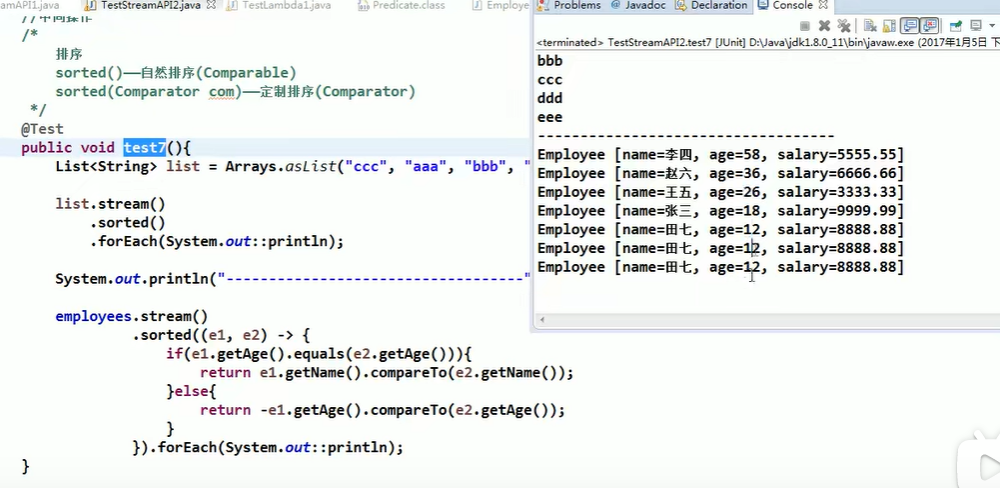

####终止操作
查找与匹配

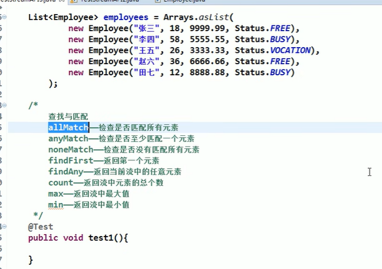

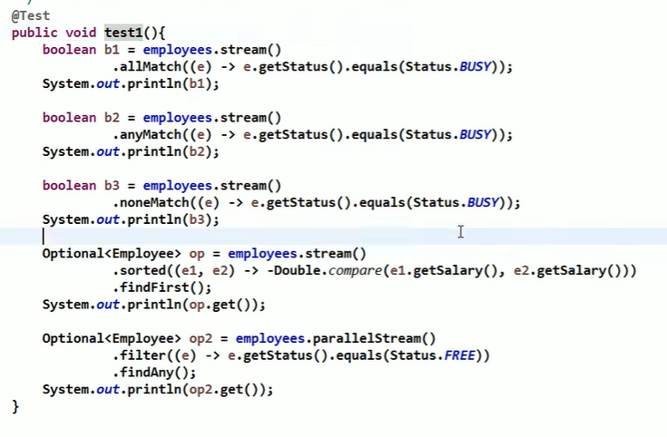

---
规约和收集
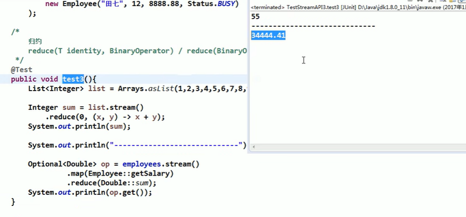

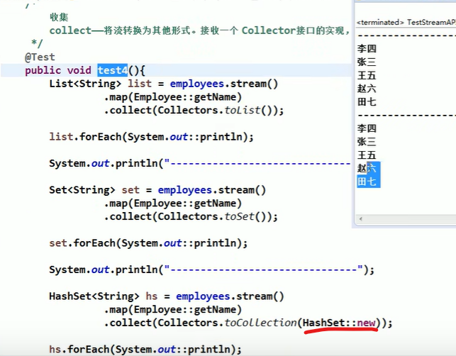

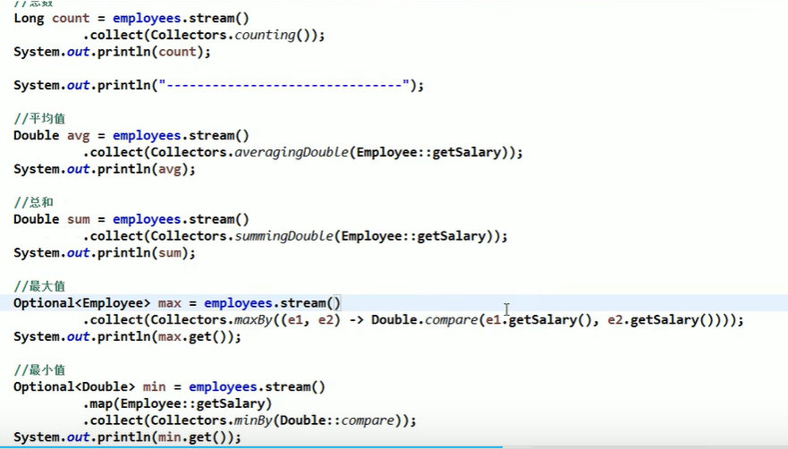

---
分组
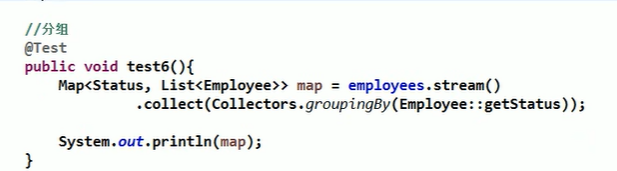

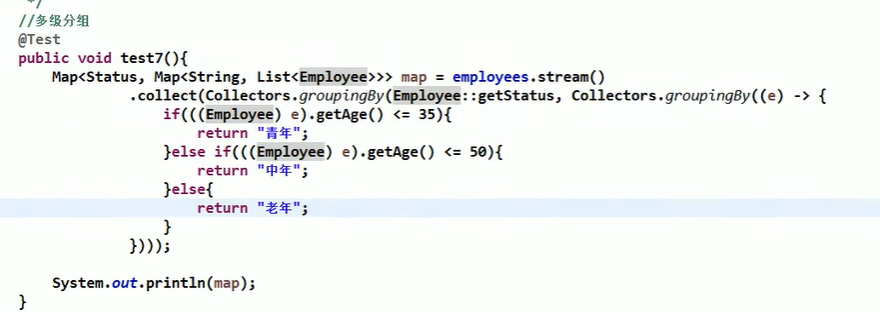

---
分区
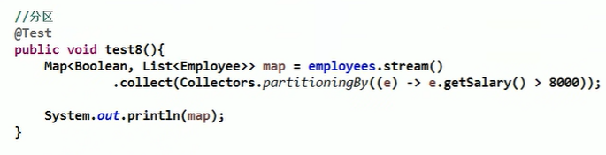

---
汇总
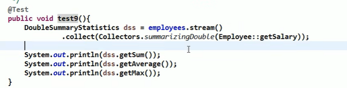

---
字符串连接
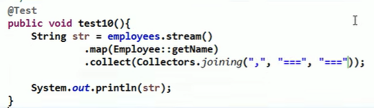

###2、练习
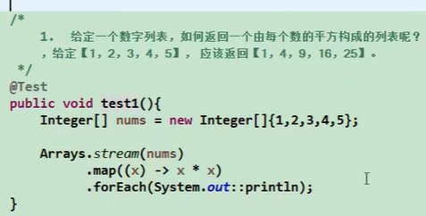

用map和reduce统计总数
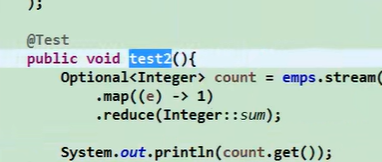

