###1.整合数据源，数据库驱动，mybatis-plus步骤：
如图所示：
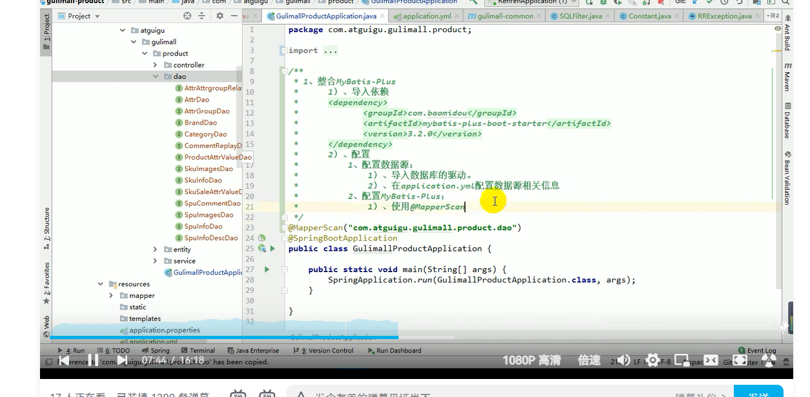
数据源和mybatis-plus配置文件如下：

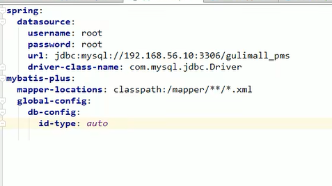
Note：mapper-location属性的配置值如果是【classpath*】
的话表示mybatis-plus扫描的时候不仅扫描当前工程指定
路径下的.mapper文件，同时也扫描所有依赖包下对应
路径下的mapper文件。

###2.依赖外部工程，抽取公用配置
如图所示，将数据库和mybatis的依赖配置都抽取到
common工程中
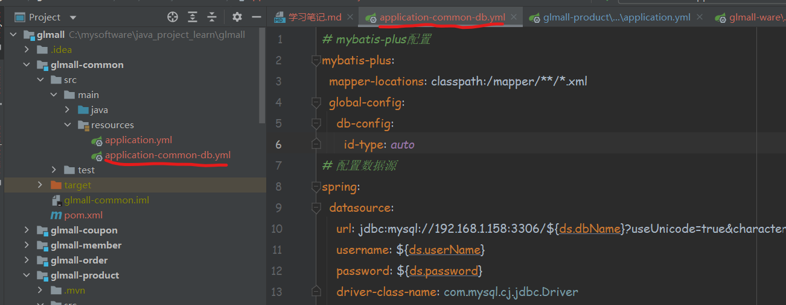

然后，在依赖common工程的工程中，用
spring.profiles.include属性指定common 工程中
需要引用的配置文件，并且配置所需要的参数
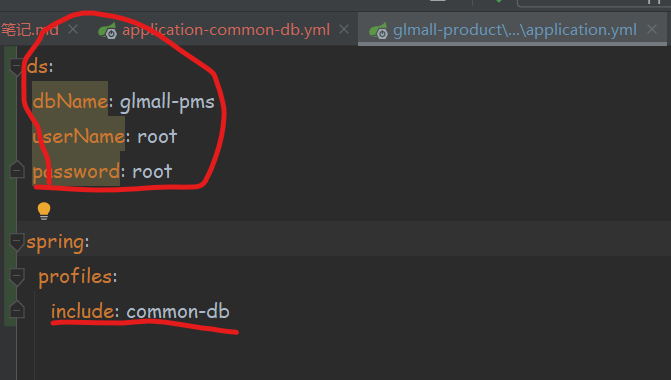

###3.关于SpringBoot，SpringCloud，SpringCloud Alibaba版本对应的问题
详见参考资料文档地址：
https://github.com/alibaba/spring-cloud-alibaba/wiki/%E7%89%88%E6%9C%AC%E8%AF%B4%E6%98%8E

###4.docker安装nacos server，笔记
步骤一：查看nacos官网：
https://nacos.io/zh-cn/docs/quick-start-docker.html

步骤二：根据步骤一中的内容提示，我们可以知道docker安装nacos的文档
是保存在这个git地址的，我们打开这个地址访问nacos的安装步骤：
https://github.com/nacos-group/nacos-docker.git

步骤三：阅读步骤二git仓库中对应部署nacos的yml文档，构建nacos容器
的运行语句：
https://github.com/nacos-group/nacos-docker/blob/master/example
/standalone-mysql-5.7.yaml
当然，这里需要根据需求，自己找到安装的yml，我这里选择的是standalone的

步骤四：去nacos官方的另外一个仓库去下载nacos外部挂载mysql数据库的
脚本：
https://github.com/alibaba/nacos/blob/develop/distribution/conf
/mysql-schema.sql

吐槽：md，nacos官方就是一群二货！

步骤五：修改nacos启动的时候外部挂载的application.properties文件内容，
主要是修改数据库链接信息：
https://github.com/nacos-group/nacos-docker/blob/master/example
/init.d/application.properties

Note：请注意，这里千万不要搞错啦！！！一旦数据库链接信息写错了，
会导致nacos容器运行起来后，咱们却无法访问到首页的情况

步骤六：运行docker语句，启动nacos容器：
docker run -p 8848:8848 -p 9848:9848 --name nacos-standalone-mysql \
-e PREFER_HOST_MODE=ip \
-e MODE=standalone \
-e SPRING_DATASOURCE_PLATFORM=mysql \
-e NACOS_AUTH_ENABLE=true \
-v /mydata/nacos/logs:/home/nacos/logs \
-v /mydata/nacos/conf/application.properties:/home/nacos/conf/application.properties \
--restart=always \
-d nacos/nacos-server:v2.1.2

注意1：如果nacos启动不成功，或者启动成功，却访问不到nacos首页，
需要查看日志的话，日志就存在/mydata/nacos/logs这个挂载目录下。

注意2：如果要开启nacos的权限认证，需要传递环境变量
NACOS_AUTH_ENABLE=true

### 5.docker 启动mysql，启动后秒失败退出。
启动命令：docker run -p 3306:3306 --name mysql_01 -v /mydata/mysql/log:/var/log/mysql -v /mydata/mysql/data:/var/lib/mysql -v /mydata/mysql/conf:/etc/mysql -e MYSQL_ROOT_PASSWORD=root -d mysql:5.7


排查问题的方式：
百度搜索：docker容器启动失败怎么查找原因
找到解决文章：
1）查看所有容器基本信息：
docker ps -a

2)找到启动失败的容器id：
44304a7e1eb7

3）定位出错日志文件的位置：
docker inspect --format '{{.LogPath}}' 44304a7e1eb7

输出：/var/lib/docker/containers/44304a7e1eb7f98c06470fada9f6718e49d38f88aa683330fa63173f04f7182d/44304a7e1eb7f98c06470fada9f6718e49d38f88aa683330fa63173f04f7182d-json.log

4）cat查看该文件内容：
cat /var/lib/docker/containers/44304a7e1eb7f98c06470fada9f6718e49d38f88aa683330fa63173f04f7182d/44304a7e1eb7f98c06470fada9f6718e49d38f88aa683330fa63173f04f7182d-json.log
{"log":"2023-03-14 02:01:51+00:00 [Note] [Entrypoint]: Entrypoint script for MySQL Server 5.7.41-1.el7 started.\n","stream":"stdout","time":"2023-03-14T02:01:51.495658324Z"}
{"log":"2023-03-14 02:01:51+00:00 [ERROR] [Entrypoint]: mysqld failed while attempting to check config\n","stream":"stderr","time":"2023-03-14T02:01:51.510010916Z"}
{"log":"\u0009command was: mysqld --verbose --help --log-bin-index=/tmp/tmp.YXEiBp7HKr\n","stream":"stderr","time":"2023-03-14T02:01:51.510039754Z"}
{"log":"\u0009mysqld: Can't read dir of '/etc/mysql/conf.d/' (Errcode: 2 - No such file or directory)\n","stream":"stderr","time":"2023-03-14T02:01:51.510044868Z"}
{"log":"mysqld: [ERROR] Fatal error in defaults handling. Program aborted!\n","stream":"stderr","time":"2023-03-14T02:01:51.510048645Z"}

###6.linux中防火墙相关操作指令：

systemctl status firewalld 查看防火墙状态

systemctl start firewalld 开启防火墙 (service firewalld start)

systemctl stop firewalld 关闭防火墙

systemctl disable firewalld 禁止开机启动防火墙

1）查询已经对外开放的端口
netstat -anp

2)查询指定端口是否对外开发
firewall-cmd --query-port=8848/tcp

开放端口命令步骤：

1.添加指定需要开放的端口：
firewall-cmd --add-port=8848/tcp --permanent

2.重载入添加的端口：
firewall-cmd --reload

3.查询指定端口是否开放成功：
firewall-cmd --query-port=8848/tcp

###7.修改虚拟机时间与宿主机时间一致

1 如果发现date与现在的时间差8个小时，需要修改。

2 date之后，发现没有CTS（中国标准时间：China Standard Time UT+8:00）

3 将/etc/localtime指向上海时间

ln -sf /usr/share/zoneinfo/Asia/Shanghai /etc/localtime

然后再date可以看到CST了。

4 下载ntp（需要联网）
yum -y install ntp

5 校对时间
ntpdate cn.pool.ntp.org

6 将系统时间写入硬件（这步如果不执行重启机器后时间又会出问题）
hwclock -w

7 查看date

###8.关于yml配置文件内容出错导致找不到配置文件的问题
management:
endpoints:
web:
exposure:
include: *

yml文件中包含以上内容，导致项目启动报错：
Failed to load property source from location 'classpath:/application.yml'
原因是includ: * 这个 * 号是通配符，加上双引号就好了

Note：* 在YAML中有特殊的含义，所以如果想使用include或者exclude包含
所有的端点时要加上双引号

###9.nacos作为配置中心的使用

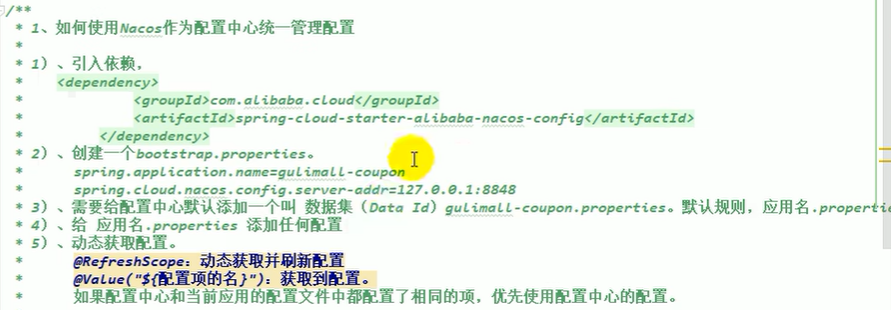
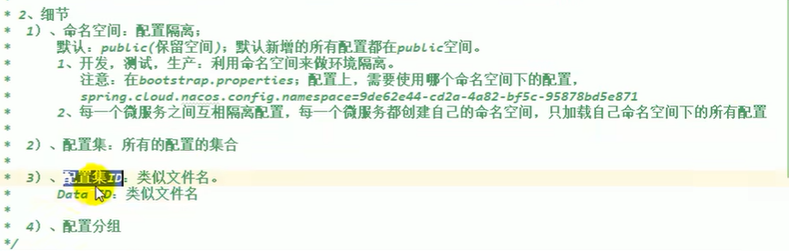
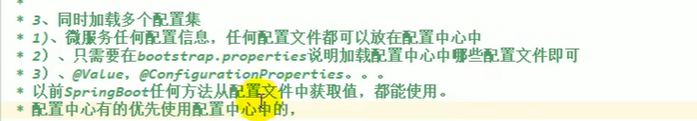
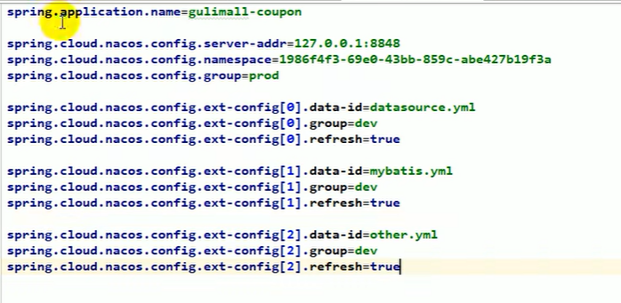

###10.nacos踩坑！！！
nacos创建配置文件的时候报错：”发布失败。请检查参数是否正确“。
排查过程：
查看日志文件，配置报错日志，记录在config-fatal.log中：
tail -fn600 config-fatal.log

原因：
Caused by: java.sql.SQLException: Field 'encrypted_data_key' doesn't have a default value
在nacos的高版本中，在config_info等表中添加了encrypted_data_key密钥字段，
由于是text字段，并且不允许为空所以，新增配置的时候报错了。

解决：
1）在nacos的github上，找到对应当前低版本的mysql语句，然后删库重建；
2）将nacos版本升级到2.x.x的版本。

###11.SpringBoot 之 Jasypt 实现yml配置文件加密
原文链接：https://blog.csdn.net/qq_41055045/article/details/126740841

参考文章：https://blog.csdn.net/m0_74931226/article/details/128433179

官方地址：https://github.com/ulisesbocchio/jasypt-spring-boot

###12.使用openfeign进行远程服务调用

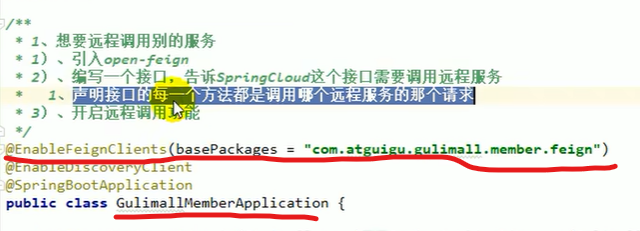

###13.使用logback+MDC实现微服务跨请求日志追踪

1）logback基础：
https://blog.csdn.net/qq_45311457/article/details/127966580
https://www.yuque.com/chengxuyuanyideng/fsokrv/twhuva
https://logback.qos.ch/manual/layouts.html （官网）

2）整合mdc：
https://blog.csdn.net/qingquanyingyue/article/details/108586549
https://segmentfault.com/a/1190000022132469?utm_source=tag-newest

想要使用mdc实现微服务调用链路追踪，首先需要了解logback的
基本配置使用；

我们springboot工程的项目都是依赖了logback作为日志管理工具的，
所以我们要做的事情相对也比较轻松：

第一步：编写适合自己工程的logback.xml文件；（参见项目中的文件）

第二步：编写tracIdUtil工具类，logInterceptor、

FeignBasicAuthRequestInterceptor拦截器，针对traceId的生成，保存，
删除要书写一套能够闭环的逻辑
第三步：在项目中添加logInterceptor拦截器，让请求进来的时候逻辑
能够生效；

第四步：在项目中添加FeignBasicAuthRequestInterceptor拦截器，
当使用feign进行远程服务调用的时候，将traceId重写入RestTemplate
中

第五步：优化，可以将logInterceptor和
FeignBasicAuthRequestInterceptor拦截器的注入配置代码，写到
common包当中，然后在其他工程的启动类中，重新写扫描注解，
扫描common中的配置类所在的包，以及当前工程的包，如示例代码：

@ComponentScan(basePackages = {"com.glmall.common.configuration", "com.glmall.coupon"},
excludeFilters = {@ComponentScan.Filter(type = FilterType.CUSTOM, classes = {TypeExcludeFilter.class}),
@ComponentScan.Filter(type = FilterType.CUSTOM, classes = {AutoConfigurationExcludeFilter.class})})

这样做的目的是减少不同工程中，对公共包bean注入，产生太多的相同
配置代码。

###14.为nodejs安装webpack
全局安装webpack：
npm install webpack -g
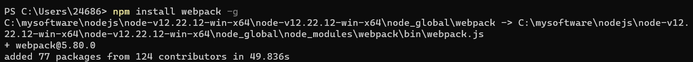

全局安装vue脚手架（vuecli）：
npm install -g @vue/cli
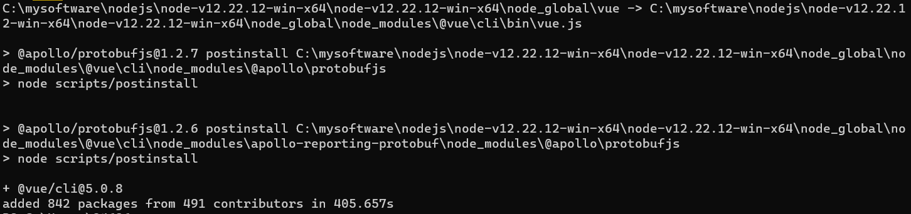

全局安装vue脚手架（vuecli-init）:
npm install -g @vue/cli-init
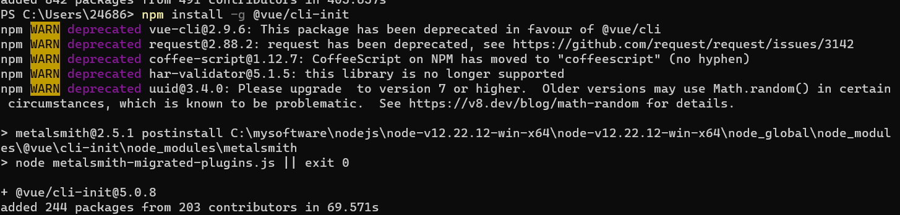

###15.前后分离下，前端请求多个服务，存在跨域的问题，如何解决？
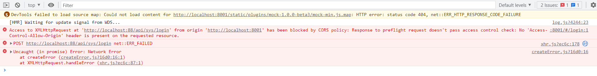
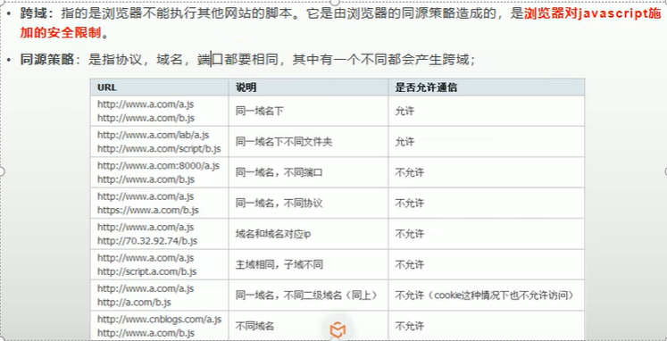
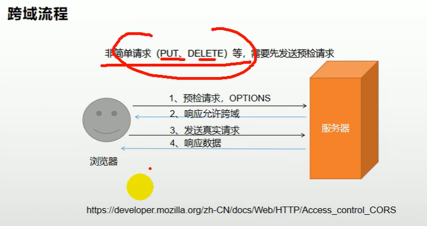
解决跨域请求几种方案：
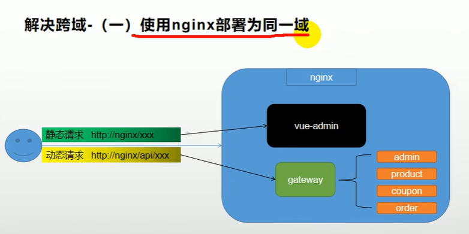
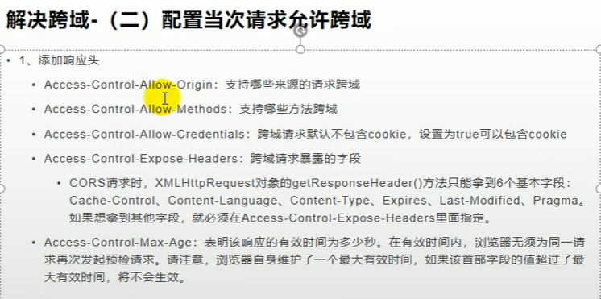
参考资料1：https://blog.csdn.net/HQqHQhqqhq/article/details/126786418

###16.mybatis-plus的逻辑删除使用

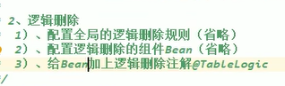

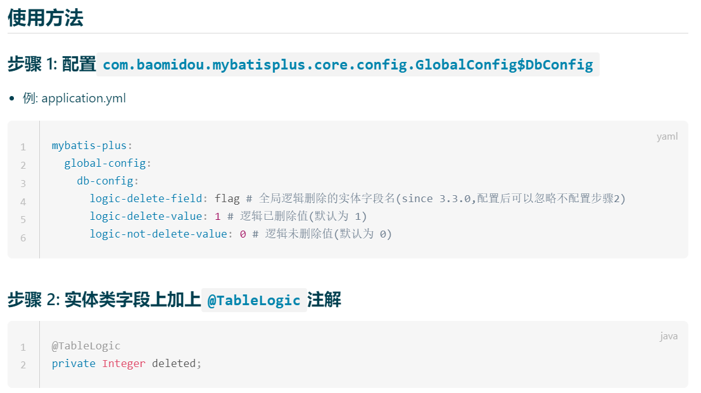  
note: 如果使用了步骤2中的注解来标注字段并且标识“删除标识值”和“未删除标志值”以后，
步骤1的全局配置可以省略不配置。

####**说明**

(1)  **只对自动注入的 sql 起效:**  

**插入**: 不作限制  
**查找**: 追加 where 条件过滤掉已删除数据,如果使用 wrapper.entity 生成的 where 条件也会自动追加该字段  
**更新**: 追加 where 条件防止更新到已删除数据,如果使用 wrapper.entity 生成的 where 条件也会自动追加该字段  
**删除**: 转变为 更新  

例如:  
删除: update user set deleted=1 where id = 1 and deleted=0  
查找: select id,name,deleted from user where deleted=0

(2)**字段类型支持说明**:

支持所有数据类型(**推荐使用** Integer,Boolean,LocalDateTime)  

如果数据库字段使用datetime,逻辑未删除值和已删除值支持配置为字符串null,另一个值支持配置为函数来获取值如now()  

(3)附录:  
逻辑删除是为了方便数据恢复和保护数据本身价值等等的一种方案，但实际就是删除。  
如果你需要频繁查出来看就不应使用逻辑删除，而是以一个状态去表示。

### 17.docker 安装minio
参考链接：
https://cloud.tencent.com/developer/article/2057224
https://blog.csdn.net/wind520/article/details/128010047
https://blog.csdn.net/weixin_44718311/article/details/127800388
https://www.jianshu.com/p/c9c637d581af

官网：
https://min.io/docs/minio/container/index.html

####1）查询minio
```linux
[root@localhost soft]# docker search minio
NAME                           DESCRIPTION                                     STARS     OFFICIAL   AUTOMATED
minio/minio                    Multi-Cloud Object Storage                      652                  [OK]
bitnami/minio                  Bitnami MinIO Docker Image                      60
minio/mc                       Minio Client (mc) provides a modern alternat…   37                   [OK]
bitnami/minio-client           Bitnami MinIO Client Docker Image               6
newrelic/synthetics-minion     Synthetics Containerized Private Minion         5
rancher/minio-minio                                                            1
ibmcom/minio                                                                   0
ibmcom/minio-ppc64le                                                           0
ibmcom/minio-mc-ppc64le                                                        0
ibmcom/minio-mc-s390x                                                          0
ibmcom/minio-s390x                                                             0
corpusops/minio                https://github.com/corpusops/docker-images/     0
ibmcom/minio-mc-amd64                                                          0
hephy/minio                                                                    0
silintl/minio-default-server                                                   0
corpusops/minio-k8s-operator   https://github.com/corpusops/docker-images/     0
corpusops/minio-mint           https://github.com/corpusops/docker-images/     0
corpusops/minio-doctor         https://github.com/corpusops/docker-images/     0
ibmcom/minio-amd64                                                             0
drud/minio-exporter                                                            0
truecharts/minio                                                               0
truecharts/minio-console                                                       0
truecharts/minio-mc                                                            0
ibmcom/minio-mc                                                                0
drud/minio                                                                     0
```

####2）下载官网镜像（**目前使用的是这个**）

```lunux
[root@localhost soft]# docker pull minio/minio
Using default tag: latest
latest: Pulling from minio/minio
d46336f50433: Pull complete
be961ec68663: Pull complete
44173c602141: Pull complete
a9809a6a679b: Pull complete
df29d4a76971: Pull complete
2b5a8853d302: Pull complete
84f01ee8dfc1: Pull complete
Digest: sha256:d786220feef7d8fe0239d41b5d74501dc824f6e7dd0e5a05749c502fff225bf3
Status: Downloaded newer image for minio/minio:latest
docker.io/minio/minio:latest
```
官网提供的镜像地址
```linux
docker pull quay.io/minio/minio
Using default tag: latest
latest: Pulling from minio/minio
28ff5ee6facb: Downloading [=================================>                 ]  26.62MB/39.35MB
28ff5ee6facb: Pull complete 
66775f6ec543: Pull complete 
7f55a9d2f614: Pull complete 
2dc0764c60d8: Pull complete 
3141fb48ed76: Pull complete 
c3ab6cf59394: Pull complete 
Digest: sha256:f1d1a7a6cc3ae54302a94a90ecf22861d17268d9b8755cc43b69cdd2e8525edc
Status: Downloaded newer image for quay.io/minio/minio:latest
quay.io/minio/minio:latest
```
####3）运行minio
```linux
mkdir -p /mydata/minio/data

（官网提供）
docker run -d \
   -p 9000:9000 \
   -p 9090:9090 \
   --name minio \
   -v /mydata/minio/data:/data \
   -e "MINIO_ROOT_USER=ROOTNAME" \
   -e "MINIO_ROOT_PASSWORD=CHANGEME123" \
   --restart=always \
   quay.io/minio/minio server /data --console-address ":9090"
   
（网友资料一）
docker run -d -p 9000:9000 --name minio \
    -e "MINIO_ACCESS_KEY=admin" \
    -e "MINIO_SECRET_KEY=admin123" \
    -v /home/admin/minio/data:/data \
    -v /home/admin/minio/config:/root/.minio \
    minio/minio server /data \
    --restart=always \
    --console-address ":9000" --address ":9090"

（网友资料二）
docker run -d -p 9000:9000 --name minio \
    -e "MINIO_ACCESS_KEY=minio" \
    -e "MINIO_SECRET_KEY=minio123" \
    -v /home/admin/minio/data:/data \
    -v /home/admin/minio/config:/root/.minio \
    minio/minio server /data \
    --restart=always \
    --console-address ":9000" --address ":9090"
```
##### 参数解释
##### docker 启动命令
docker run
##### docker 容器名称
--name minio
##### -p 容器和宿主机端口映射关系 （宿主端口：容器端口）
-p 9000:9000 -p 9090:9090
##### -d 后台运行 --restart 自动重启
-d --restart=always \
##### 设置用户名和密码 这里要注意密码一定要大于八位，不然会启动失败
-e "MINIO_ROOT_USER=admin" -e "MINIO_ROOT_PASSWORD=admin123" \
##### 指定挂载盘
-v C:\minio\data:/data -v C:\minio\config:/root/.minio minio/minio server /data \
##### 启动端口，9000标识web端访问端口，9090标识客户端访问端口
--console-address ":9000" -address ":9090"

####4）访问minio
http://192.168.1.158:9000/

