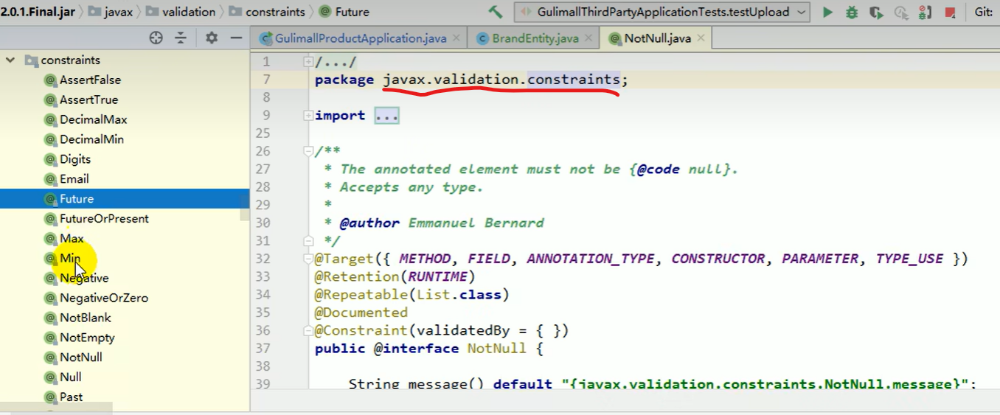
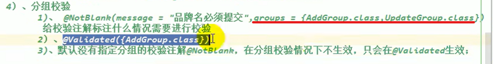
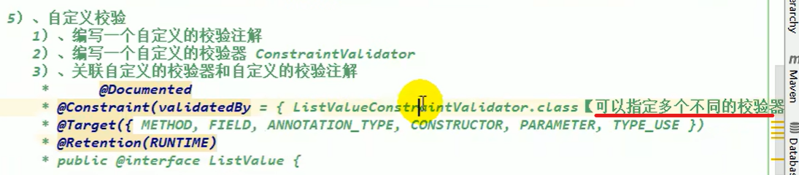
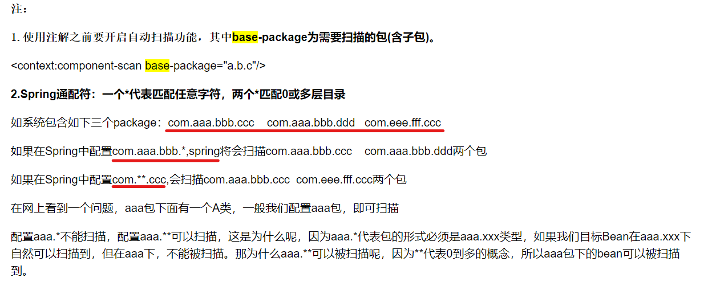
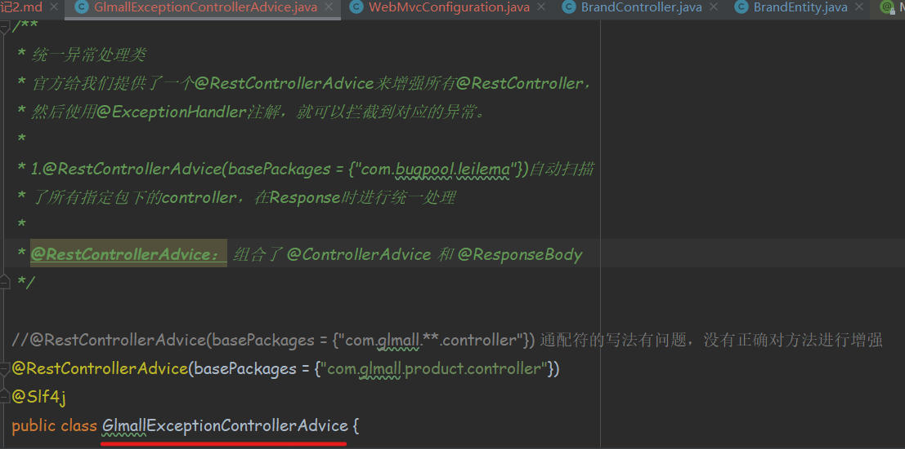
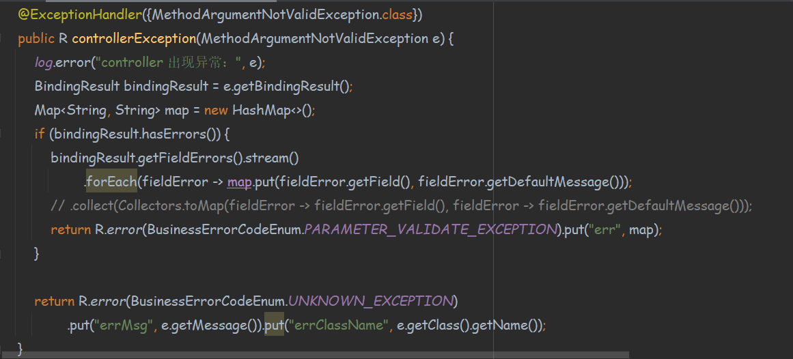
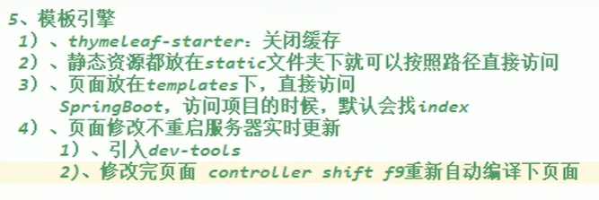
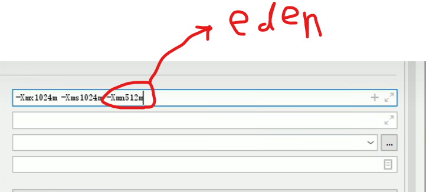

###1.JSR303校验
校验注解在 *javax.validation.constraints* 包下，如图：


使用jsr303校验步骤：  
1）在controller方法的形参列表需要校验的参数的类中，对其字段添加约束
规则注解，这些注解在这个包下能够找到：javax.validation.constraints

2）在controller方法的形参列表需要校验的参数的前边，添加@Valid注解，
表面该接口的这个参数接受到参数的时候，需要对参数进行验证  

3）如果需要获取校验结果，封装成我们自己需要的结果返回的时候，我们
可以在被校验的参数后边添加一个 BindingResult 的参数，就能够获取到
校验的结果了

4）关于分组校验的情况：


5）自定义校验：

参见文件：  
ListValue.java，ListValueConstraintValidator.java，
ValidationMessages_zh_CN.properties

###2.springBoot中关于注解的通配符


###3.SpringBoot中的统一异常处理




###4.vue父子组件事件传递


###5.docker 安装es和kibana
参考文档：https://www.jianshu.com/p/804fe0fa6702

dokcer中安装elastic search

（1）下载ealastic search和kibana
```shell
docker pull elasticsearch:7.10.1
docker pull kibana:7.10.1
```

（2）配置

```shell
mkdir -p /mydata/elasticsearch/config
mkdir -p /mydata/elasticsearch/data
# elasticsearch.yml中添加“http.host: 0.0.0.0”，
# 配置Elasticsearch可被任意主机连接
echo "http.host: 0.0.0.0" >/mydata/elasticsearch/config/elasticsearch.yml
chmod -R 777 /mydata/elasticsearch/
```
（3）启动Elastic search
```shell
docker run --name elasticsearch -p 9200:9200 -p 9300:9300 \
-e  "discovery.type=single-node" \
-e ES_JAVA_OPTS="-Xms64m -Xmx512m" \
-v /mydata/elasticsearch/config/elasticsearch.yml:/usr/share/elasticsearch/config/elasticsearch.yml \
-v /mydata/elasticsearch/data:/usr/share/elasticsearch/data \
-v /mydata/elasticsearch/plugins:/usr/share/elasticsearch/plugins \
--restart=always \
-d elasticsearch:7.10.1 
```

（4）查询es运行的ip
```shell
# 要通过以下命令来查询es运行的ip地址
docker inspect elasticsearch
```

（5）启动kibana
```shell
docker run --name kibana -e ELASTICSEARCH_HOSTS=http://172.17.0.4:9200 -p 5601:5601 \
--restart=always -d kibana:7.10.1
```

### 6.es的一些相关操作（一），查询操作

```shell
# 查询所有的索引信息
GET /_cat/indices

# 默认分页返回10条
GET /bank/_search?q=*&sort=account_number:asc

# 查询条件：query.match_all，没有过滤条件，匹配所有记录
# 排序规则：sort，先按照账号升序，然后按照余额降序
GET /bank/_search
{
  "query": {
    "match_all": {}
  },
  "sort": [
    {
      "account_number": {
        "order": "asc"
      },
      "balance": {
        "order": "desc"
      }
    }
  ]
}

# 分页查询：from,size；类似于mysql的limit 0,5
# 查询指定的属性，类似于mysql查询指定的列
GET /bank/_search
{
  "query": {
    "match_all": {}
  },
  "sort": [
    {
      "balance": {
        "order": "desc"
      }
    }
  ],
  "from": 0,
  "size": 5,
  "_source": ["balance","firstname"]
}

# match:匹配查询;类似于mysql的account_number=20
# 当match使用在非字符字段的时候进行匹配查询，类似于相等于；当使用在字符字段的时候进行全文检索（进行分词检索）
GET /bank/_search
{
  "query": {
    "match": {
      "address": "mill lane"
    }
  }
}

# 全文检索按照评分进行排序，会对检索条件进行分词匹配

# match_phrase，短语匹配，不进行分词，类似于mysql里的like %xxoo% 条件语法；

GET /bank/_search
{
  "query": {
    "match_phrase": {
      "address": "Holmes lane"
    }
  }
}

# multi_match，多字段全文检索匹配，fields中所有字段,对query中条件进行全文检索匹配，匹配到的数据都查出来

GET /bank/_search
{
  "query": {
    "multi_match": {
      "query": "mill lane GA",
      "fields": ["state","address"]
    }
  },
  "from": 0,
  "size": 50
}

# bool复合查询，合并多个查询条件
# must：必须满足
# must_not: 必须不是
# should: 满足该条件最好，不满足也可以

GET /bank/_search
{
  "query": {
    "bool": {
      "must": [
        {
          "match": {
            "gender": "M"
          }
        },
        {
          "match": {
            "address": "mill"
          }
        }
      ],
      "must_not": [
        {
          "match": {
            "age": "18"
          }
        }
      ],
      "should": [
        {
          "match": {
            "lastname": "Wallace"
          }
        }
      ],
      "filter": [
        {
          "range": {
            "age": {
              "gte": 18,
              "lte": 30
            }
          }
        }
      ]
    }
  },
  "from": 0,
  "size": 500
}

# must：会贡献相关性得分

GET /bank/_search
{
  "query": {
    "bool": {
      "must": [
        {
          "range": {
            "age": {
              "gte": 18,
              "lte": 30
            }
          }
        }
      ]
    }
  }
}

#filter:不会贡献相关性得分
GET /bank/_search
{
  "query": {
    "bool": {
      "filter": [
        {
          "range": {
            "age": {
              "gte": 18,
              "lte": 30
            }
          }
        }
      ]
    }
  }
}

# term: 全文检索推荐使用match，精确字段推荐使用term
# es在保存text字段的时候，存在分词分析的操作，会将text进行分词倒排索引。所以，使用term来检索text文本字段（string类型的字段）是相当困难的，大概率检索不到，如下例子查不到数据，但是match则可以
GET /bank/_search
{
  "query": {
    "term": {
      "address": "789 Madison Street"
    }
  }
}

# match，分词
GET /bank/_search
{
  "query": {
    "match": {
      "address": "789 Madison Street"
    }
  }
}

# match_phrase，不分词
GET /bank/_search
{
  "query": {
    "match_phrase": {
      "address": "789 Madison Street"
    }
  }
}

# 字段.keyword：对字段进行精确查找，不分词
GET /bank/_search
{
  "query": {
    "match": {
      "address.keyword": "789 Madison Street"
    }
  }
}

# 字段.keyword与match_phrase的区别
# 下例中，match_phrase查到1条记录，而.keyword查不出记录；
# .keyword：相当于mysql的等于操作
# match_phrase：相当于mysql的like操作

GET /bank/_search
{
  "query": {
    "match_phrase": {
      "address": "789 Madison"
    }
  }
}

GET /bank/_search
{
  "query": {
    "match": {
      "address.keyword": "789 Madison"
    }
  }
}

# 实践约定：
# 非文本字段使用term查询；
# 文本字段使用match；
# 文本精确使用.keyword
```

### 7.es的一些相关操作（二），聚合操作

```shell
# aggregation：聚合操作，将查询结果数据进行聚合运算后响应

# 需求：搜索address中“包含mill”的所有人的“年龄分布”，以及“平均年龄”，但是不显示这些人的详情

# 聚合类型terms：获取指定字段的数据分布
# terms.field：对指定字段进行聚合
# terms.size:取出指定个数的聚合结果
GET bank/_search
{
  "query": {
    "match": {
      "address": "mill"
    }
  },
  "aggs": {
    "ageAgg": {
      "terms": {
        "field": "age",
        "size": 10
      }
    },
    "ageAvg": {
      "avg": {
        "field": "age"
      }
    },
    "balanceAvg": {
      "avg": {
        "field": "balance"
      }
    }
  },
  "size": 0
}

# 需求：按照年龄聚合，并且请求这些年龄段的这些人的平均薪资
# ageAgg.terms.aggs:针对年龄进行分布聚合后，再进行每个年龄段进行子聚合，参见下例：
GET bank/_search
{
  "query": {
    "match_all": {}
  },
  "aggs": {
    "ageAgg": {
      "terms": {
        "field": "age",
        "size": 100
      },
      "aggs": {
        "balanceAvg": {
          "avg": {
            "field": "balance"
          }
        }
      }
    }
  },
  "size": 0
}

# 查询所有年龄分布，并且这些年龄段中性别为m的平均薪资和性别f的平均薪资，
# 以及这些年龄段的平均薪资
GET bank/_search
{
  "query": {
    "match_all": {}
  },
  "aggs": {
    "ageAgg": {
      "terms": {
        "field": "age",
        "size": 100
      },
      "aggs": {
        "balanceAgeAgg":{
          "avg": {
            "field": "balance"
          }
        },
        "genderAgg": {
          "terms": {
            "field": "gender.keyword"
          },
          "aggs": {
            "balanceAvg": {
              "avg": {
                "field": "balance"
              }
            },
            "sumAgg": {
              "sum": {
                "field": "balance"
              }
            }
          }
        }
        
      }
    }
  }, 
  "size": 0
}
```

### 8.es中mapping的字段类型


映射相关操作
```shell
# mapping映射操作：类似于我们mysql中定义表结构的时候，设计字段类型等等

# 查看bank字段的映射信息
GET bank/_mapping

# 创建索引，并且编写映射规则
PUT /my_index
{
  "mappings": {
    "properties": {
      "age": {
        "type": "integer"
      },
      "email": {
        "type": "keyword"
      },
      "name": {
        "type": "text",
        "fields": {
          "keyword": {
            "type": "keyword",
            "ignore_above": 256
          }
        }
      }
    }
  }
}

# 添加新的字段
# index：表示该字段是否是可以被查询
#（检索）的
PUT /my_index/_mapping
{
  "properties": {
    "employeeId": {
      "type": "keyword",
      "index": false
    }
  }
}

GET my_index/_mapping

# 修改已经存在的映射：不能修改已经存在字段的映射；要想修改已经存在字段的映射，只能删除索引，迁移数据，重新创建正确的索引

GET bank/_mapping

PUT /newbank
{
  "mappings": {
    "properties": {
      "account_number": {
        "type": "long"
      },
      "address": {
        "type": "text"
      },
      "age": {
        "type": "integer"
      },
      "balance": {
        "type": "long"
      },
      "city": {
        "type": "keyword"
      },
      "email": {
        "type": "keyword"
      },
      "employer": {
        "type": "keyword"
      },
      "firstname": {
        "type": "text"
      },
      "gender": {
        "type": "keyword"
      },
      "lastname": {
        "type": "text",
        "fields": {
          "keyword": {
            "type": "keyword",
            "ignore_above": 256
          }
        }
      },
      "state": {
        "type": "keyword"
      }
    }
  }
}

GET newbank/_mapping

# 迁移数据，将bank索引的数据迁移到newbank

POST _reindex
{
  "source": {
    "index": "bank",
    "type": "account"
  },
  "dest": {
    "index": "newbank"
  }
}

GET newbank/_search


# 7.0以后不推荐使用type了

```

### 9.Linux安装lrzsz安装使用
参考链接：https://blog.csdn.net/yang913yang/article/details/127305334

###10.模板引擎
Thyme leaf


### 11.一些虚拟机参数：



