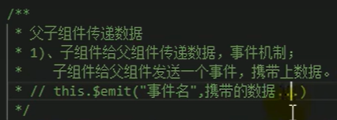

###1.JSR303校验
校验注解在 *javax.validation.constraints* 包下，如图：

使用jsr303校验步骤：  
1）在controller方法的形参列表需要校验的参数的类中，对其字段添加约束
规则注解，这些注解在这个包下能够找到：javax.validation.constraints

2）在controller方法的形参列表需要校验的参数的前边，添加@Valid注解，
表面该接口的这个参数接受到参数的时候，需要对参数进行验证  

3）如果需要获取校验结果，封装成我们自己需要的结果返回的时候，我们
可以在被校验的参数后边添加一个 BindingResult 的参数，就能够获取到
校验的结果了

4）关于分组校验的情况：

5）自定义校验：

参见文件：  
ListValue.java，ListValueConstraintValidator.java，
ValidationMessages_zh_CN.properties

###2.springBoot中关于注解的通配符

###3.SpringBoot中的统一异常处理

###4.vue父子组件事件传递

