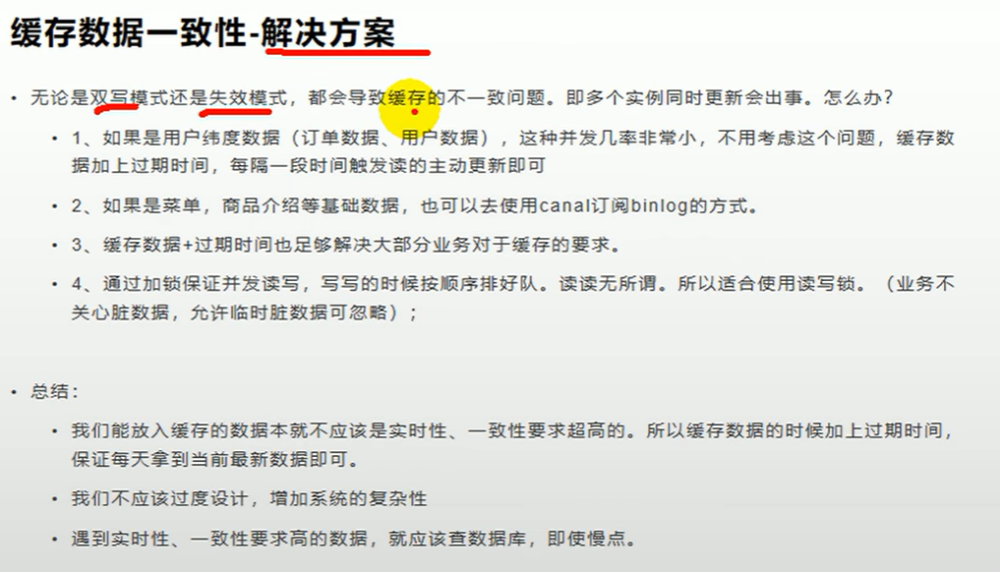

###1.整合redis

###2.springBoot2.x使用lettuce的坑

###4.可重入锁与不可重入锁

###5.redisson使用体验  

官网：https://github.com/redisson/redisson/wiki/8.-%E5%88%86%E5%B8%83%E5%BC%8F%E9%94%81%E5%92%8C%E5%90%8C%E6%AD%A5%E5%99%A8  

基本的锁使用：  

tryLock操作：  

ReadWriteLock:

信号量 Semaphore

闭锁 CountDownLatch

###6.缓存一致性：解决方案

使用cannel解决缓存一致性问题，或者解决
数据异构问题
  

canal的使用参考链接：  
https://blog.csdn.net/Kanmeijie/article/details/115364263  
https://github.com/alibaba/canal/wiki/Docker-QuickStart  
https://github.com/alibaba/canal

###7.SpringCache

整合SpringCache：  
  

注解@Cacheable的使用：  
@Cacheable(cacheNames = "category") 表示方法请求的结果将被缓存；  
     如果缓存中有这个数据，方法将不被调用，直接去缓存中获取结果返回  
     如果缓存中没有这个数据，则会将返回值缓存  
     需要指定缓存的名字，这是作为缓存分区的依据  
 默认行为：  
     1）如果缓存中有，方法不用调用  
     2）key默认自动生成，缓存名字：category::SimpleKey []（key是自动生成的）  
     3）缓存的value的值，是jdk序列化后的结果  
     4）默认缓存时间：-1，即永远不超时  
自定义：  
     1）指定缓存key的名字：使用key指定缓存名称，它接受一个SpEL  
     2）指定缓存失效时间，在配置文件中指定ttl  
     3）将数据保存为json格式  
     note: springCache不支持在注解上设置过期时间，如果需要实现这个功能，  
      请参考博文：https://blog.csdn.net/m0_71777195/article/details/127260380  
      参考almall-common的CustomizedRedisCacheManager和MyRedisCacheConfig
      类的实现  

@CacheEvict的使用  

####SpringCache的不足：  

