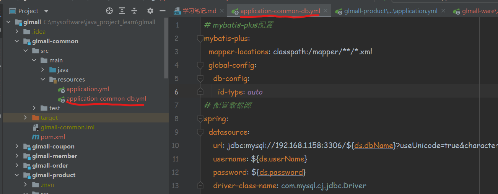

###1.整合数据源，数据库驱动，mybatis-plus步骤：
如图所示：

数据源和mybatis-plus配置文件如下：

Note：mapper-location属性的配置值如果是【classpath*】
的话表示mybatis-plus扫描的时候不仅扫描当前工程指定
路径下的.mapper文件，同时也扫描所有依赖包下对应
路径下的mapper文件。

###2.依赖外部工程，抽取公用配置
如图所示，将数据库和mybatis的依赖配置都抽取到
common工程中

然后，在依赖common工程的工程中，用
spring.profiles.include属性指定common 工程中
需要引用的配置文件，并且配置所需要的参数

###3.关于SpringBoot，SpringCloud，SpringCloud Alibaba版本对应的问题
详见参考资料文档地址：
https://github.com/alibaba/spring-cloud-alibaba/wiki/%E7%89%88%E6%9C%AC%E8%AF%B4%E6%98%8E

